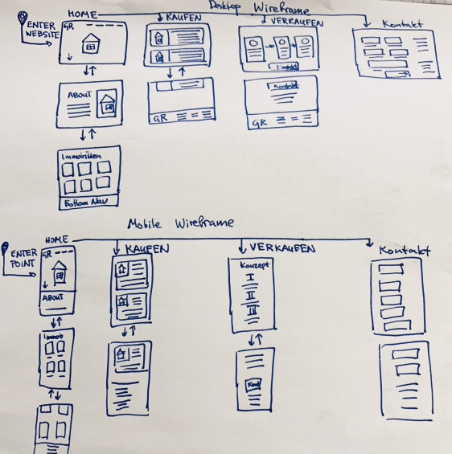
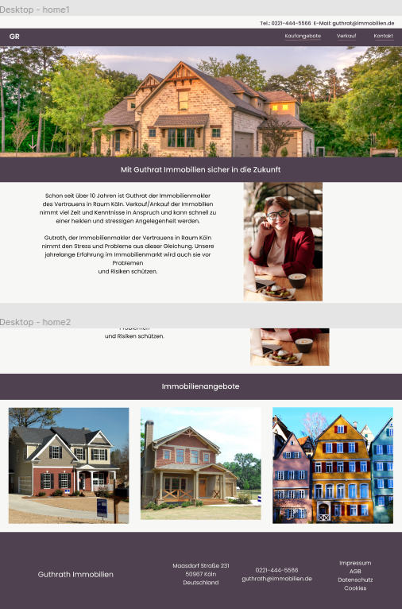
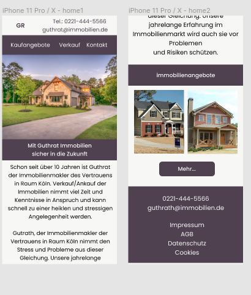
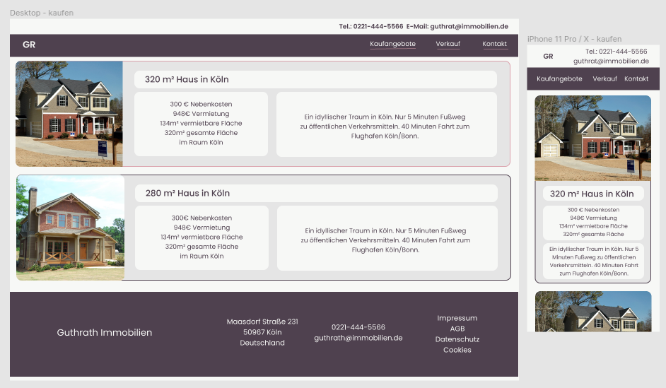
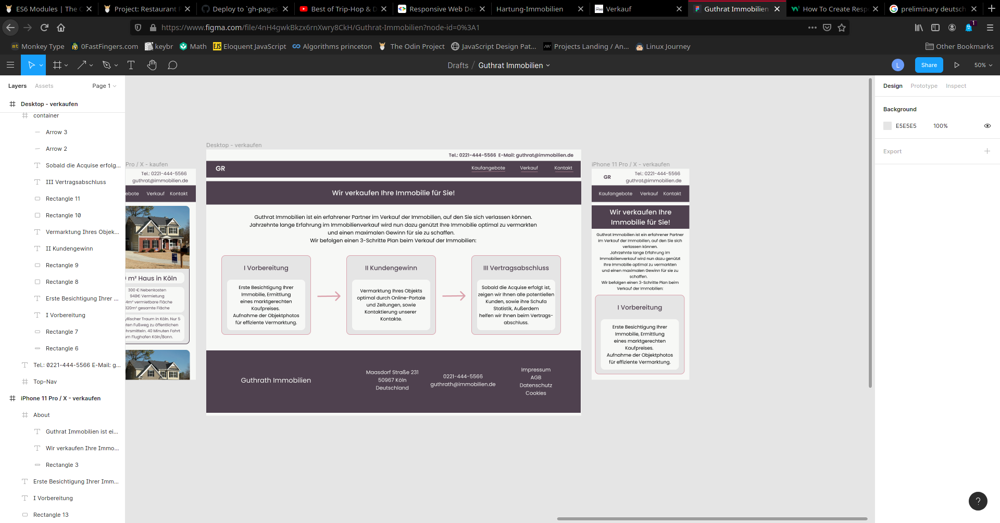
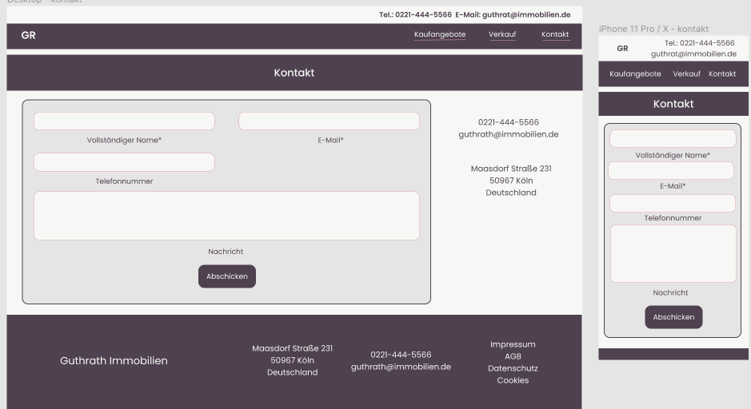

# Guthrat Immobilien
A website for a real estate agent (in German). All of the `HTML` elements are created dynamically with `Javascript`. JS is separated into files and bundled up with `webpack` before deployment.

## Project/Learning Goals
- create a website for a real estate agent, that is both minimalistic/easy to navigate + modern but still looks conservative, professional and sets up the real estate agent as someone who you can rely on. 
- use this project to learn `Javascript modules` and bundling them up with `webpack`
- improve your `DOM` manipulation skills by leaving the `HTML` files as empty as possible and creating all of the content dynamically with `Javascript`
- make the design responsive and intuitive, look into design layouts
- learn to define a minimum viable product and stick with it (avoid feature creep)

## MVP specification (Minimum Viable Product)
1. Top nav bar with contact info and maybe a logo
1. Home with a bit of a sell pitch + nice photo of the agent, perhaps what people write about the agency and/or its certificates
1. A menu from which you can access:  
  - "Home" Who is the real estate agent, what does he promise. Home should just be the Logo of the agent.
  - "Immobilienangebote" cards with house photos + descriptions
  -  "Verkauf" description of the step by step how you sell real estate via this agent 
  -  "Kontakt" a contact form

2. Bottom nav bar with "Impressum", "AGB", "Datenschutz" should make the website look more professional

## Project Roadmap
- [x] set up all the directories, gitignore and config files necessary for webpack
- [x] research the MVP for real estate agents and come up with a wireframe: 
  
- [x] create a desktop design for the page in Figma 
- [x] create a mobile design for the landing page in figma
- [x] create a design (mobile and desktop with Figma) for real estate listings page 
- [x] create a design (mobile and desktop with Figma) for the buyers page 
- [x] create a design (mobile and desktop with Figma) with contact forms 
- [ ] create a static prototype page with multiple html files
- [ ] tweak the css until it matches the design as well as possible, if something isn't possible atm, admit defeat and try to incorporate an acceptable substitute + learn from experience
- [ ] create a dummy page + basic css layout and connect a few modules to each other (code infrastructure setup)
- [ ] plan out/ pseudo code the modules
- [ ] transfer all the html tags into the js files

## Learning experiences
- Wireframes are important for the user experience flow and give you a good high level overview over the project. What is necessary, and where you can cut the fat. You can determine, what is intuitive and where the user might have some troubles. They are pretty good if you want to avoid getting caught up in the details.
- learned to use CSS custom properties (also called css variables sometimes). They are supported by most browsers as of now, but would have to avoid them if I had users that use IE.